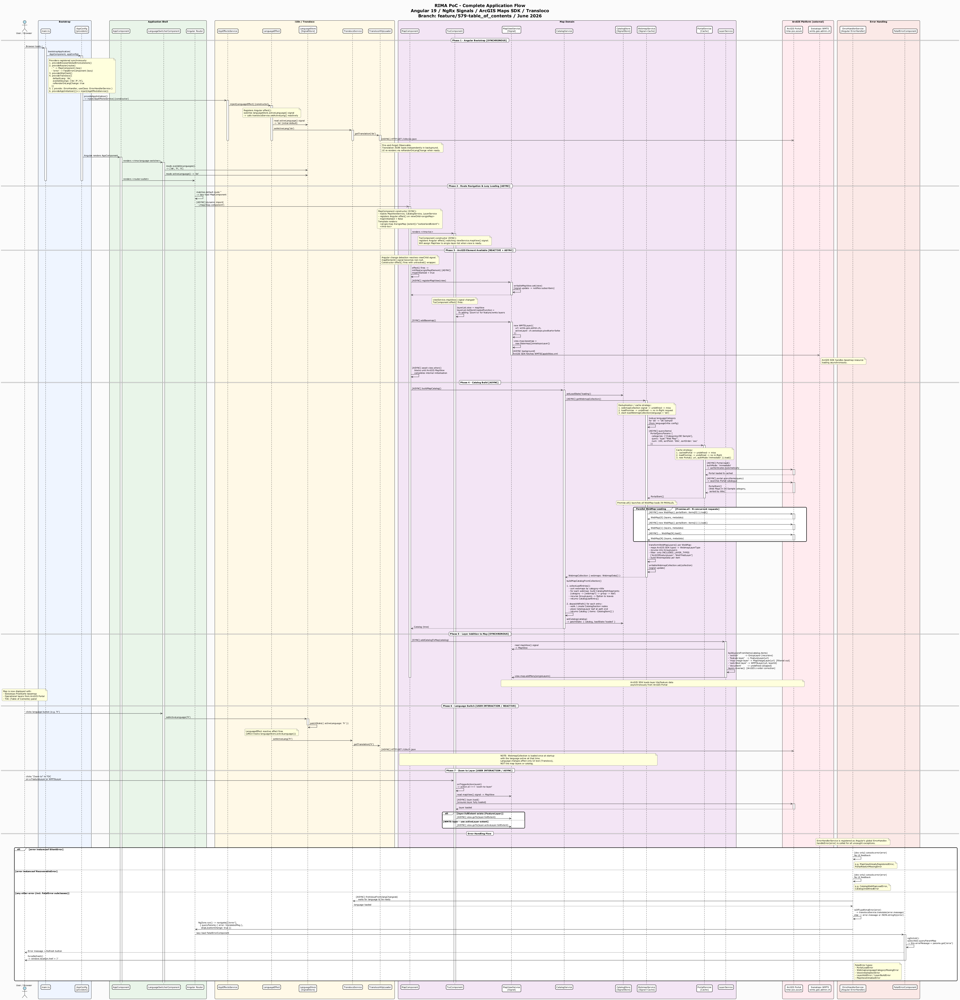

# RIMA PoC – Living Documentation

This document serves as the index for the RIMA PoC web client documentation. Each section is maintained in its own folder alongside related diagrams and assets.

---

## Sections

| Task | Topic                      | Link                                                                              |
| ---- | -------------------------- | --------------------------------------------------------------------------------- |
| 604  | Base Web Client Components | [application-startup.md](./604-base_web_client_components/application-startup.md) |
| 644  | Web Client Content Catalog | [content-catalog.md](./644-webclient_content_catalog/content-catalog.md)          |
| 579  | Table of Contents (ToC)    | [table-of-contents.md](./579-table_of_contents/table-of-contents.md)              |

## Application Flow Diagram

